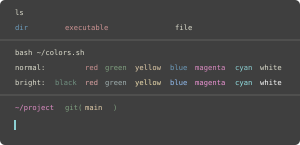
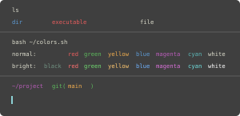
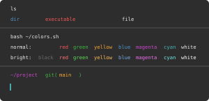

# Warp Zenburn Themes

Zenburn-inspired themes for [Warp Terminal](https://www.warp.dev/), including colorblind-friendly variants.

## About

These themes are based on the original [Zenburn color scheme](https://github.com/jnurmine/Zenburn) by Jani Nurminen, a low-contrast color scheme designed to be easy on the eyes during extended coding sessions.

## Themes

### Zenburn
The classic Zenburn theme adapted for Warp Terminal.



- **Background**: Medium-dark gray (`#3f3f3f`)
- **Foreground**: Soft beige (`#dcdccc`)
- **Philosophy**: Low contrast, warm tones, easy on the eyes
- **Best for**: Extended coding sessions, low-light environments

### Zenburn Colorblind
A colorblind-friendly variant of Zenburn with enhanced color differentiation.



- **Background**: Medium-dark gray (`#3f3f3f`)
- **Foreground**: Soft beige (`#dcdccc`)
- **Modifications**:
  - Adjusted red/green colors for better deuteranopia/protanopia distinction
  - Enhanced blue/magenta separation
  - More vibrant color palette while maintaining the Zenburn aesthetic
- **Best for**: Users with red-green color blindness, preserving readability

### Zenburn Colorblind High Contrast
A high-contrast, colorblind-friendly variant for maximum readability.



- **Background**: Darker gray (`#2d2d2d`)
- **Foreground**: Brighter off-white (`#eaeaea`)
- **Modifications**:
  - Significantly darker background for better contrast
  - Brighter foreground text
  - More saturated colors for clear distinction
  - Enhanced cursor visibility with bright green (`#47cc7c`)
  - Optimized for both colorblind users and those needing higher contrast
- **Best for**: Users needing both colorblind accessibility and high contrast, bright environments

## Installation

1. Copy the desired `.yaml` file(s) to your Warp themes directory:
   ```bash
   cp *.yaml ~/.warp/themes/
   ```

2. In Warp, open Settings → Appearance → Theme and select your preferred Zenburn variant.

## Credits

Original Zenburn color scheme: [github.com/jnurmine/Zenburn](https://github.com/jnurmine/Zenburn)

## License

These theme adaptations are based on the original Zenburn color scheme and are distributed under the same license.

GNU GPL, http://www.gnu.org/licenses/gpl.html
